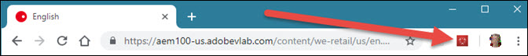

# Instalar Experience Cloud Debugger {#install-experience-cloud-debugger}

Baixe e instale a extensão do Adobe Experience Cloud Debugger para Chrome na [página de extensão do Chrome](https://chrome.google.com/webstore/detail/adobe-experience-cloud-de/ocdmogmohccmeicdhlhhgepeaijenapj).

Depois de instalar a extensão, um ícone é adicionado à barra de extensão do Chrome:

>[!VIDEO](https://video.tv.adobe.com/v/23114t2/?captions=por_br)
