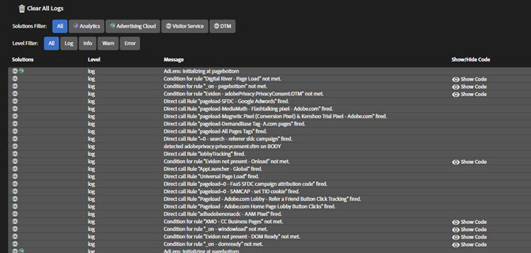

# Logs {#logs}

A tela Logs fornece informações específicas para implementações do DTM. A ferramenta Depuração de console do DTM não precisa ser ativada para exibir essas informações. É possível filtrar pelas soluções implementadas por meio das ferramentas DTM associadas. Você pode escolher qual dos seguintes níveis de gravidade de problema é exibido na tela:

* Log
* Info
* Avisos
* Erros

Alguns itens de log do DTM incluem uma opção Mostrar código na mensagem. Clique em **[!UICONTROL Show Code]** para exibir o código condicional que determina se uma regra deve ser acionada.
