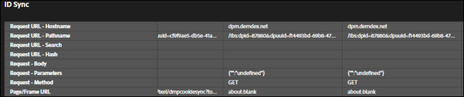

# Guias Solução {#solution-tabs}

Clique nas guias Solução para ver os resultados para soluções específicas da Adobe Experience Cloud.

## Analytics {#section-f71dfcc22bb44c86bec328491606a482}

A guia Analytics fornece informações sobre a implementação do [Analytics](https://experiencecloud.adobe.com/resources/help/pt_BR/reference/).

**Hits**

Por padrão, todas as chamadas de servidor feitas para o mesmo conjunto de relatórios são recolhidas.

**Download:** baixe as informações sobre todos os conjuntos de relatórios exibidos como planilha do Excel.

**Limpar todas as solicitações:** remova todas as solicitações mostradas da exibição do Analytics. Depois que você apagar as solicitações, novas solicitações serão exibidas quando ocorrerem.

Clique na ID do conjunto de relatórios para expandir a exibição:

Esta tela exibe todas as solicitações desde que o Debugger foi aberto ou que as solicitações foram apagadas. Os parâmetros padrão são mapeados automaticamente para nomes familiares. As variáveis [prop e eVar](https://experiencecloud.adobe.com/resources/help/pt_BR/sc/implement/props_eVars.html) podem ser mapeadas até os nomes familiares personalizados (por exemplo, "prop1" pode ser exibido como "Tipo de usuário"), se você autenticar usando o recurso "Análise de link" (veja abaixo). As solicitações são exibidas em sequência, da esquerda para a direita.

**Download:** salve todas as solicitações feitas no conjunto de relatórios como planilha do Excel.

**Limpar solicitações:** remova todas as solicitações feitas neste conjunto de relatórios. Novas solicitações são exibidas à medida que ocorrerem.

**Contas vinculadas (herdadas)**

Clique em **[!UICONTROL Link Account]** e insira as informações solicitadas para vincular uma conta do Analytics ao Debugger.

>[!NOTE]
>
>No momento, esse recurso é compatível apenas com credenciais de logon de usuário herdadas do Analytics.

**Recuperar hits pós-processadas**

Ative a opção Recuperar hits pós-processadas se desejar visualizar os valores nos hits do Analytics, após a execução das regras de processamento. Você deve estar conectado à Adobe Experience Cloud para que esse recurso funcione.

Quando essa opção está ativada, um parâmetro de depuração é adicionado às solicitações do Analytics. Os hits continuam sendo processados como qualquer outro hit. O Debugger pesquisa a API de depuração do Analytics para recuperar valores de regras pós-processamento para os hits com uma ID de hit original. Os hits pós-processados têm um fundo violeta e são exibidos ao lado do hit original.

Para a maioria das implementações do Analytics, as informações de regras pós-processamento estão disponíveis em alguns minutos. A implementação do Analytics para Target (A4T) leva consideravelmente mais tempo.

## Target {#section-988873ba5ede4317953193bd7ac5474c}

Use a guia Target para exibir as solicitações do [Target](https://docs.adobe.com/content/help/pt-BR/target/using/target-home.html) ou os detalhes de resposta do [Mbox Trace](https://docs.adobe.com/content/help/pt-BR/target/using/activities/troubleshoot-activities/content-trouble.html).

Clique em **[!UICONTROL Requests]** e expanda o ambiente para exibir as informações sobre o Target.

Clique em **[!UICONTROL Clear All Requests]** para remover as solicitações exibidas no momento. Mais solicitações serão exibidas à medida que forem feitas.

Você também pode usar o filtro Target para [ativar o MBox Trace for Target para fins de depuração](https://docs.adobe.com/content/help/pt-BR/target/using/activities/troubleshoot-activities/content-trouble.html).

É necessário abrir uma guia Chrome autenticada na Experience Cloud para ativar o Mbox Trace. Depois de ativado, ele mostra o nome de usuário da Adobe ID. Expanda o nome de usuário para expor os códigos de cliente do Target associados às organizações da Experience Cloud às quais você tem acesso. Clique no código de cliente para o qual você deseja ativar o Mbox Trace e confirme se a marca de seleção verde é exibida. Todas as solicitações do Target com informações do Mbox Trace serão exibidas, agrupadas por código de cliente. Para explorar as informações do Mbox Trace, expanda a solicitação para ver as guias:

* [Atividades](https://docs.adobe.com/content/help/pt-BR/target/using/activities/activities.html) A guia Atividades mostra todas as atividades associadas ao nome da solicitação do Target, independentemente de você se qualificar para a atividade. "Atividades correspondentes" são as atividades para as quais você se qualificou e cujas ofertas foram fornecidas na resposta. Você pode expandir o nome da atividade para confirmar a experiência em que está e quais públicos-alvo e condições de direcionamento o qualificaram para a atividade. "Atividades avaliadas" são todas as atividades avaliadas, independentemente de você se qualificar. Para solucionar os problemas do motivo pelo qual você não está qualificado para uma atividade "Avaliada", mas não "Correspondente", expanda o nome da atividade e confira a seção "Públicos sem correspondência".

* Solicitação

   A guia de solicitação do [Mbox Trace](https://docs.adobe.com/content/help/pt-BR/target/using/activities/troubleshoot-activities/content-trouble.html) é semelhante à guia de solicitação principal. Você pode exibir todos os parâmetros transmitidos pela solicitação do Target, além dos cabeçalhos da solicitação.
* Perfil

   Expanda a seção Instantâneo do perfil para ver as [informações do perfil](https://docs.adobe.com/content/help/pt-BR/target/using/audiences/visitor-profiles/variables-profiles-parameters-methods.html) armazenadas sobre você como um visitante no banco de dados do perfil do Target. Todos os perfis de in-mbox e script são expostos aqui, bem como alguns perfis do sistema. A coluna Status mostra quais perfis foram alterados dentro do escopo desta solicitação, bem como seus valores antes e depois que a solicitação entrou no sistema de perfil.
* Audience Manager

   As seções "segmentIds" e "cachedSegmentIds" da guia Audience Manager expõem as IDs de [públicos](https://docs.adobe.com/content/help/pt-BR/target/using/audiences/target.html) compartilhados da Experience Cloud para o Target e para as quais você se qualificou. Podem ser públicos-alvo criados no Audience Manager, no Analytics ou no Audience Builder no People Core Service. Essas IDs podem ser pesquisadas na interface do usuário do Audience Manager para localizar o nome do público-alvo.

O vídeo a seguir mostra a funcionalidade geral do Target:

>[!VIDEO](https://video.tv.adobe.com/v/23115t2/?captions=por_br)

O vídeo a seguir mostra o Mbox Trace:

>[!VIDEO](https://video.tv.adobe.com/v/23113t2/?captions=por_br)

## Audience Manager {#section-1d4484f8b46f457f859ba88039a9a585}

Use a guia [Audience Manager](https://docs.adobe.com/content/help/pt-BR/audience-manager/user-guide/aam-home.html) para exibir detalhes de [eventos](https://docs.adobe.com/content/help/pt-BR/audience-manager/user-guide/api-and-sdk-code/dcs/dcs-event-calls/dcs-event-calls.html). Clique na organização para expandi-la e mostrar as informações.

Clique em **[!UICONTROL Clear All Events]** para redefinir as informações exibidas. Novos eventos serão exibidos à medida que ocorrerem.

**Sincronização de ID**

A sincronização de ID é a primeira etapa do processo de transferência de dados assíncrono de entrada. Nesta etapa, o Audience Manager e o fornecedor comparam e correspondem IDs para os respectivos visitantes do site.

Consulte [Sincronização de ID para transferências de dados de entrada](https://docs.adobe.com/content/help/pt-BR/audience-manager/user-guide/implementation-integration-guides/sending-audience-data/batch-data-transfer-process/id-sync-http.translate.html) na Documentação do produto do Audience Manager, para obter mais informações.

## Advertising Cloud {#section-ee80a9c509f2462c89c1e5bd8d05d7c8}

Use a guia Advertising Cloud para exibir as solicitações da Advertising Cloud.

Clique em **[!UICONTROL Requests]**, em seguida expanda o ambiente para exibir as informações sobre a Advertising Cloud.

Clique em **[!UICONTROL Clear All Requests]** para remover as solicitações exibidas no momento. Mais solicitações serão exibidas à medida que forem feitas.

## Serviço da Experience Cloud ID {#section-a96c32f8e63a4991abb296f6e8ea01cf}

Use a guia Serviço da Experience Cloud ID para exibir as solicitações do [Serviço da Experience Cloud ID](https://experiencecloud.adobe.com/resources/help/pt_BR/mcvid/).

Clique em **[!UICONTROL Requests]** e, em seguida, expanda o ambiente para exibir as informações sobre o Serviço da Experience Cloud ID.

Clique em **[!UICONTROL Clear All Requests]** para remover as solicitações exibidas no momento. Mais solicitações serão exibidas à medida que forem feitas.
