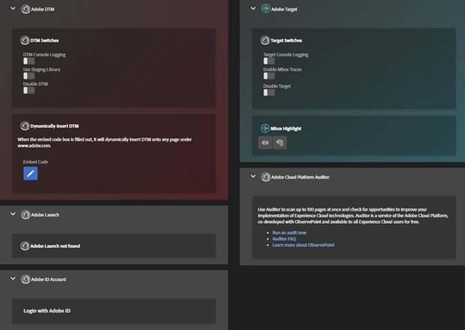
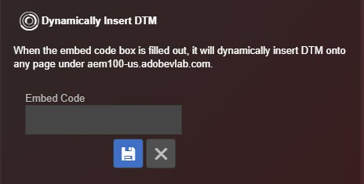

# Ferramentas{#tools}

Na tela Ferramentas, você pode ativar ou desativar várias ferramentas para a solução instalada. Por exemplo, você pode ativar as instruções de depuração do console do Target ou usar a Biblioteca de preparo do DTM. Essas ferramentas só estarão disponíveis se o Target e o DTM estiverem instalados na página.

Você pode inserir dinamicamente o Adobe Experience Platform Launch ou DTM em qualquer página para testar algo em uma página que não tenha o Platform Launch ou o DTM instalado. Clique no ícone **[!UICONTROL Embed Code]**, em seguida digite o [código incorporado](https://docs.adobe.com/content/help/pt-BR/dtm/using/client-side/deployment.html) e clique em **[!UICONTROL Save]**.

## Informações do DTM {#section-c3d43040440449e5a050170843a600b7}

<table id="table_04625C3319134E169A35DB74C1D1FB31"> 
 <thead> 
  <tr> 
   <th colname="col1" class="entry"> Ferramenta </th> 
   <th colname="col2" class="entry"> Descrição </th> 
  </tr>
 </thead>
 <tbody> 
  <tr> 
   <td colname="col1"> 
 Registro do console do DTM 
 </td> 
   <td colname="col2"> 
Essa ferramenta expõe as instruções de depuração específicas do DTM para o console do navegador. 
 </td> 
  </tr> 
  <tr> 
   <td colname="col1"> 
Usar biblioteca de preparo 
 </td> 
   <td colname="col2"> 
Essa ferramenta usa a biblioteca de preparo para obter as informações de depuração do DTM. 
 </td> 
  </tr> 
  <tr> 
   <td colname="col1"> 
Desativar DTM 
 </td> 
   <td colname="col2"> 
Essa ferramenta bloqueia a verificação das informações do DTM. 
 </td> 
  </tr> 
  <tr> 
   <td colname="col1"> 
 Inserir dinamicamente o DTM 
 </td> 
   <td colname="col2"> 
 Essa ferramenta insere o código do DTM na página. Use o editor do Código de incorporação para editar o código inserido. 
 </td> 
  </tr> 
 </tbody> 
</table>

## Informações do Target {#section-31090d95f50e455692b672c26e6a2051}

<table id="table_A71D269B49F4417599EBACA44D5CCF4F"> 
 <thead> 
  <tr> 
   <th colname="col1" class="entry"> Ferramenta </th> 
   <th colname="col2" class="entry"> Descrição </th> 
  </tr>
 </thead>
 <tbody> 
  <tr> 
   <td colname="col1"> 
Registro do console do Target 
 </td> 
   <td colname="col2"> 
Esta ferramenta expõe as instruções de depuração específicas do Target para o console do navegador, tudo começando com o prefixo  AT:, adicionando um cookie chamado mboxDebug=true no navegador. No momento, as instruções do console não aparecem na tela Registros do Debugger, mas são visíveis no console de depuração nativo do navegador. 
 
 Esta ferramenta requer o at.js 0.9.6+. Se você estiver usando uma versão anterior do at.js, poderá adicionar o parâmetro da sequência de consulta ?mboxDebug=true ao URL para ativar o registro do console. Se você estiver usando o mbox.js, poderá adicionar o parâmetro ?_AT_Debug=console para ativar o registro do console limitado às atividades do Visual Experience Composer. 
 </td> 
  </tr> 
  <tr> 
   <td colname="col1"> 
 Ativar Mbox Traces 
 </td> 
   <td colname="col2"> 
Esta ferramenta adiciona as informações detalhadas nas respostas do Target, que podem ser exploradas na tela Target&gt;Mbox Trace do depurador. 
 
 Você deve fazer logon na Experience Cloud em uma das guias do Chrome para ativar essa ferramenta. 
 </td> 
  </tr> 
  <tr> 
   <td colname="col1"> 
Desativar o Target 
 </td> 
   <td colname="col2"> 
Esta ferramenta desativa todas as solicitações do Target, adicionando um cookie chamado mboxDisable=true no navegador. 
 
 Esta ferramenta requer o at.js 0.9.6+. Se você estiver usando uma versão mais antiga, poderá adicionar o parâmetro da sequência de consulta ?mboxDisable=true  ao URL para desativar mboxes. 
 </td> 
  </tr> 
  <tr> 
   <td colname="col1"> 
 Realce da mbox 
 </td> 
   <td colname="col2"> 
 Esta ferramenta desenha uma caixa vermelha em torno das mboxes herdadas no estilo de quebra automática. 
 </td> 
  </tr> 
 </tbody> 
</table>

O vídeo a seguir explica como usar a extensão do Debugger com o Adobe Target.

>[!VIDEO](https://video.tv.adobe.com/v/23115t2/)
