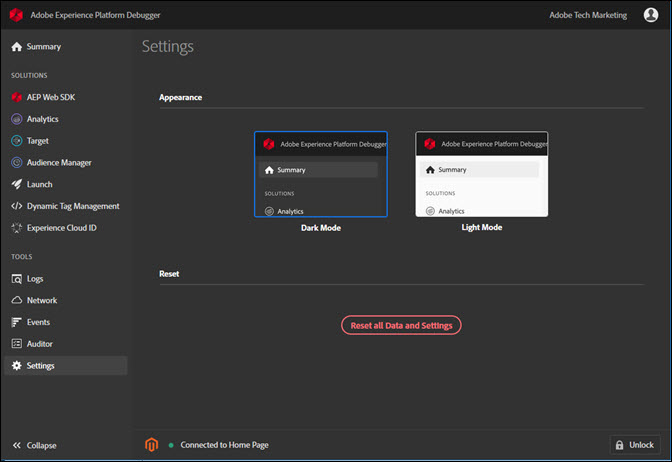

# Configurar o Depurador

> [!IMPORTANT]
>
> O Adobe Experience Cloud Debugger 2.0 está atualmente em beta. A documentação e a funcionalidade estão sujeitas a alterações.

Você pode configurar certos aspectos de como o Debugger é exibido e funciona.

## Modo claro ou escuro

Depois que o Debugger for aberto, você poderá selecionar sua aparência preferida, ao acessar ****e selecionar **Modo escuro**(padrão) ou **Modo claro.**

## Redefinir

Clique em **[!UI CONTROLE Redefinir todos os dados e configurações]** para retornar para limpar todos os dados e retornar às configurações padrão.

## Bloquear o Depurador em uma página

À medida que você altera páginas em seu site, a janela do Debugger é atualizada para mostrar informações dessa página. O nome da página à qual você está conectado aparece na parte inferior da tela. Para manter o Debugger bloqueado em uma página, clique em **[!UICONTROL Lock]** no canto inferior direito da janela Debugger.

Isso é útil se você estiver lendo a documentação ou vendo informações em outra página durante a depuração da página.