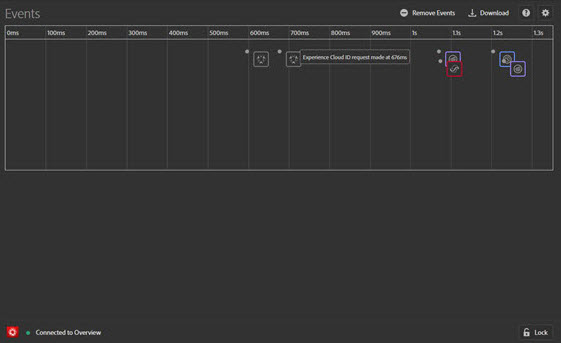
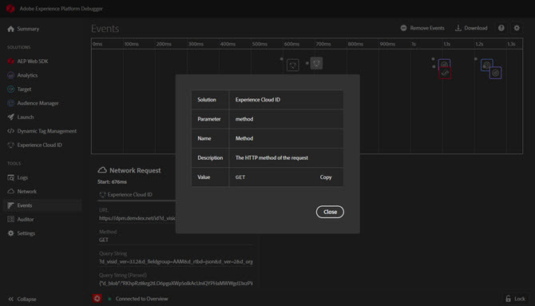

# Guia Eventos

A variável **Eventos** fornece uma exibição gráfica dos eventos que ocorrem, exibidos em uma linha do tempo.

Para cada evento, um ícone da solução aplicável da é exibido na linha do tempo. Os ícones também mostram as alterações na camada de dados (se ativada). Passe o mouse sobre um ícone para ver um resumo do evento. Selecione no evento para obter mais detalhes. É possível selecionar com a tecla Shift pressionada ou selecionar com a tecla Control pressionada para exibir vários eventos.

Selecione em um detalhe para obter mais informações.

## Rastrear alterações na camada de dados

Para ativar na linha do tempo o rastreamento de alterações na camada de dados:

1. Selecione o ícone de engrenagem na parte superior direita.
1. Insira o nome da camada de dados.

   

1. Selecione **[!UICONTROL Save]**.

Os detalhes de alterações da camada de dados mostram qualquer coisa que foi excluída ou adicionada. É possível selecionar **{}** para enxergar mais fundo na camada de dados.

## Baixar informações do evento

Selecionar **[!UICONTROL Download]** para baixar um arquivo de Excel que mostra informações sobre suas chamadas de página.
