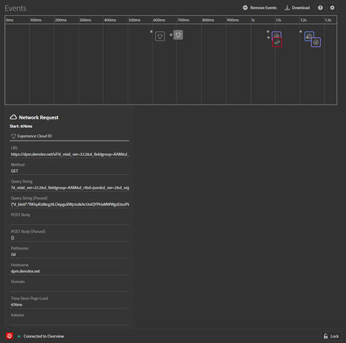

# Eventos {#events}

A tela Eventos fornece uma exibição gráfica dos eventos que ocorrem, exibidos em uma linha do tempo.

Para cada evento, um ícone da solução aplicável da Experience Cloud é exibido na linha do tempo. Os ícones também mostram as alterações na camada de dados (se ativada). Passe o mouse sobre um ícone para ver um resumo do evento. Clique no evento para obter mais detalhes. É possível clicar com a tecla Shift pressionada ou com a tecla Control pressionada para exibir vários eventos.

Clique em um detalhe para obter mais informações.

## Rastrear alterações na camada de dados

Para ativar na linha do tempo o rastreamento de alterações na camada de dados:

1. Clique no ícone de engrenagem na parte superior direita.
1. Insira o nome da camada de dados.
   
1. Clique em **[!UICONTROL Save]**.

Os detalhes de alterações da camada de dados mostram qualquer coisa que foi excluída ou adicionada. Você pode clicar em **{}** para enxergar mais fundo na camada de dados.

## Baixar informações do evento

Clique em **[!UICONTROL Download]** para baixar um arquivo de Excel que mostra informações sobre suas chamadas de página.