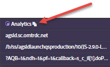

# Informações de rede{#network-information}

Para exibir Informações de rede, clique em **[!UICONTROL Rede]**.

A tela Rede agrega todas as chamadas de solução da Adobe Experience Cloud feitas na página e as exibe em ordem da esquerda para a direita. Os parâmetros padrão são rotulados automaticamente com nomes amigáveis e organizados para agrupar parâmetros comuns na mesma função.

>[!TIP]
>
>Essa tela é útil para confirmar se os parâmetros usados para integrações, como a ID de visitante da Experience Cloud ou a ID de dados complementares, são consistentes em integrações.

>[!NOTE]
>
>No momento, nem todos os parâmetros passados nas chamadas da solução (por exemplo, variáveis de contexto do Analytics, parâmetros personalizados do Target ou IDs do cliente do serviço da Experience Cloud ID) estão visíveis na tela Rede.

Para exibir todas as informações, selecione **[!UICONTROL Todos]**.

Você também pode filtrar as informações por solução. Selecione as soluções que deseja visualizar. É possível exibir várias soluções ao mesmo tempo. Os filtros de solução selecionados são realçados.

Clique em um item na exibição Rede para vê-lo maior. Na janela de exibição expandida, é possível copiar as informações exibidas para a Área de transferência.

Use o ícone na parte superior de cada coluna para copiar o URL da chamada do servidor para a área de transferência, onde você pode colá-lo em outro documento para fins de referência ou depuração.

