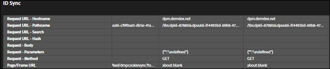

# Guias de solução{#solution-tabs}

Clique nas guias de solução para ver os resultados de soluções específicas da Adobe Experience Cloud.

## Analytics {#section-f71dfcc22bb44c86bec328491606a482}

A guia Analytics fornece informações sobre a implementação do [Analytics](https://experiencecloud.adobe.com/resources/help/en_US/reference/) .

**Ocorrências**

Por padrão, todas as chamadas de servidor feitas para o mesmo conjunto de relatórios são recolhidas.

**** Download: Baixe informações sobre todos os conjuntos de relatórios exibidos como uma planilha do Excel.

**** Limpar todas as solicitações: Remova todas as solicitações exibidas da exibição do Analytics. Depois que você apagar as solicitações, novas solicitações serão exibidas quando ocorrerem.

Clique na ID do conjunto de relatórios para expandir a exibição:

Esta tela exibe todas as solicitações desde que o Depurador foi aberto ou as solicitações foram apagadas. Os parâmetros padrão são mapeados automaticamente para nomes amigáveis. [As variáveis prop e eVar](https://experiencecloud.adobe.com/resources/help/en_US/sc/implement/props_eVars.html) podem ser mapeadas para seus nomes amigáveis personalizados (por exemplo, "prop1" pode ser exibido como "Tipo de usuário") se você autenticar usando o recurso "Análise de link" (veja abaixo). As solicitações são exibidas em sequência da esquerda para a direita.

**** Download: Salve todas as solicitações feitas no conjunto de relatórios como uma planilha do Excel.

**** Limpar solicitações: Remova todas as solicitações feitas neste conjunto de relatórios. Novas solicitações são exibidas à medida que ocorrem.

**Contas vinculadas (herdadas)**

Clique em **[!UICONTROL Vincular conta]** e insira as informações solicitadas para vincular uma conta do Analytics ao Depurador.

>[!NOTE]
>
>Atualmente, esse recurso é compatível apenas com credenciais de logon de usuário herdadas do Analytics.

**Recuperar ocorrências pós-processadas**

Ative a opção Recuperar ocorrências pós-processadas se desejar visualizar os valores nas ocorrências do Analytics após a execução das regras de processamento. Você deve estar conectado à Adobe Experience Cloud para que esse recurso funcione.

Quando essa opção está ativada, um parâmetro de depuração é adicionado às solicitações do Analytics. As ocorrências continuam sendo processadas como qualquer outra ocorrência. O depurador pesquisa a API de depuração do Analytics para recuperar valores de regras de pós-processamento para quaisquer ocorrências que tenham uma ID de ocorrência original. As ocorrências pós-processadas têm um fundo violeta e são exibidas ao lado da ocorrência original.

Para a maioria das implementações do Analytics, as informações de regras de pós-processamento estão disponíveis em alguns minutos. A implementação do Analytics para Target (A4T) leva significativamente mais tempo.

## Target {#section-988873ba5ede4317953193bd7ac5474c}

Use a guia Target para exibir as solicitações do [Target](https://docs.adobe.com/content/help/en/target/using/target-home.html) ou os detalhes de resposta do [Mbox Trace](https://docs.adobe.com/content/help/en/target/using/activities/troubleshoot-activities/content-trouble.html) .

Clique em **[!UICONTROL Solicitações]** e expanda o ambiente para exibir informações sobre o Target.

Clique em **[!UICONTROL Limpar todas as solicitações]** para remover as solicitações atualmente exibidas. Serão apresentadas mais solicitações à medida que forem feitas.

Você também pode usar o filtro Target para [ativar o Rastreamento MBox para fins](https://docs.adobe.com/content/help/en/target/using/activities/troubleshoot-activities/content-trouble.html)de depuração do Target.

É necessário ter uma guia Chrome aberta, autenticada na Experience Cloud, para ativar o Rastreamento de mbox. Depois de habilitado, ele mostra o nome de usuário da Adobe Id. Expanda o nome de usuário para expor os códigos de cliente do Target associados às organizações da Experience Cloud às quais você tem acesso. Clique no código do cliente para o qual você deseja ativar o Rastreamento de mbox e confirme se a marca de seleção verde é exibida. Todas as solicitações do Target com informações do Rastreamento de mbox serão exibidas, agrupadas por código de cliente. Para explorar as informações do Rastreamento de mbox, expanda a solicitação para ver as guias:

* [Atividades](https://docs.adobe.com/content/help/en/target/using/activities/activities.html) A guia Atividades mostra todas as atividades associadas ao nome da solicitação do Target, independentemente de você se qualificar para a atividade. "Atividades Correspondentes" são as atividades para as quais você se qualificou e cujas ofertas foram fornecidas na resposta. Você pode expandir o nome da atividade para confirmar a experiência em que você está e quais públicos-alvo e condições de definição de metas o qualificaram para a atividade. "Atividades avaliadas" são todas as atividades avaliadas, independentemente de você se qualificar. Para solucionar problemas por que você não está se qualificando para uma atividade que foi "Avaliada", mas não "Correspondida", expanda o nome da atividade e reveja a seção "Públicos sem correspondência".

* Solicitação

   A guia de solicitação do Rastreamento de [mbox](https://docs.adobe.com/content/help/en/target/using/activities/troubleshoot-activities/content-trouble.html) é semelhante à guia de solicitação principal. Você pode exibir todos os parâmetros passados pela solicitação do Target, além dos cabeçalhos da solicitação.
* Perfil

   Expanda a seção Instantâneo do perfil para ver as informações [do](https://docs.adobe.com/content/help/en/target/using/audiences/visitor-profiles/variables-profiles-parameters-methods.html) perfil armazenadas sobre você como um visitante no banco de dados do perfil do Target. Todos os perfis in-mbox e de script são expostos aqui, bem como alguns perfis do sistema. A coluna Status mostra quais perfis foram alterados dentro do escopo desta solicitação, bem como seus valores antes e depois que a solicitação entrou no sistema de perfil.
* Audience Manager

   As seções "segmentIds" e "cachedSegmentIds" da guia Audience Manager expõem as IDs de [públicos](https://docs.adobe.com/content/help/en/target/using/audiences/target.html) compartilhados da Experience Cloud para o Target e para os quais você se qualificou. Esses podem ser públicos-alvo criados no Audience Manager, Analytics ou no construtor de público-alvo no serviço principal de pessoas. Essas IDs podem ser pesquisadas na interface do usuário do Audience Manager para localizar o nome do público-alvo.

O vídeo a seguir mostra a funcionalidade geral do Target:

>[!VIDEO](https://video.tv.adobe.com/v/23115t2/?captions=por_br)

O vídeo a seguir mostra Mbox Trace:

>[!VIDEO](https://video.tv.adobe.com/v/23113t2/?captions=por_br)

## Audience Manager {#section-1d4484f8b46f457f859ba88039a9a585}

Use a guia [Audience Manager](https://experiencecloud.adobe.com/resources/help/en_US/aam/) para exibir detalhes de [eventos](https://experiencecloud.adobe.com/resources/help/en_US/aam/dcs-event-calls.html). Clique na organização para expandi-la e mostrar as informações.

Clique em **[!UICONTROL Limpar todos os eventos]** para redefinir as informações exibidas. Novos eventos serão exibidos à medida que ocorrem.

**Sincronização de ID**

A sincronização de ID é a primeira etapa do processo de transferência de dados assíncrono de entrada. Nesta etapa, o Audience Manager e o fornecedor comparam e correspondem IDs para os respectivos visitantes do site.

Consulte Sincronização de [ID para transferências](https://experiencecloud.adobe.com/resources/help/en_US/aam/c_id_sync_in.html) de dados de entrada na Documentação do produto do Audience Manager para obter mais informações.

## Advertising Cloud {#section-ee80a9c509f2462c89c1e5bd8d05d7c8}

Use a guia Advertising Cloud para exibir as solicitações da Advertising Cloud.

Clique em **[!UICONTROL Solicitações]** e, em seguida, expanda o ambiente para exibir informações sobre a Advertising Cloud.

Clique em **[!UICONTROL Limpar todas as solicitações]** para remover as solicitações atualmente exibidas. Serão apresentadas mais solicitações à medida que forem feitas.

## Serviço da Experience Cloud ID {#section-a96c32f8e63a4991abb296f6e8ea01cf}

Use a guia Serviço da Experience Cloud ID para exibir as solicitações do Serviço [da](https://experiencecloud.adobe.com/resources/help/en_US/mcvid/) Experience Cloud ID.

Clique em **[!UICONTROL Solicitações]** e expanda o ambiente para exibir informações sobre o Serviço da Experience Cloud ID.

Clique em **[!UICONTROL Limpar todas as solicitações]** para remover as solicitações atualmente exibidas. Serão apresentadas mais solicitações à medida que forem feitas.
